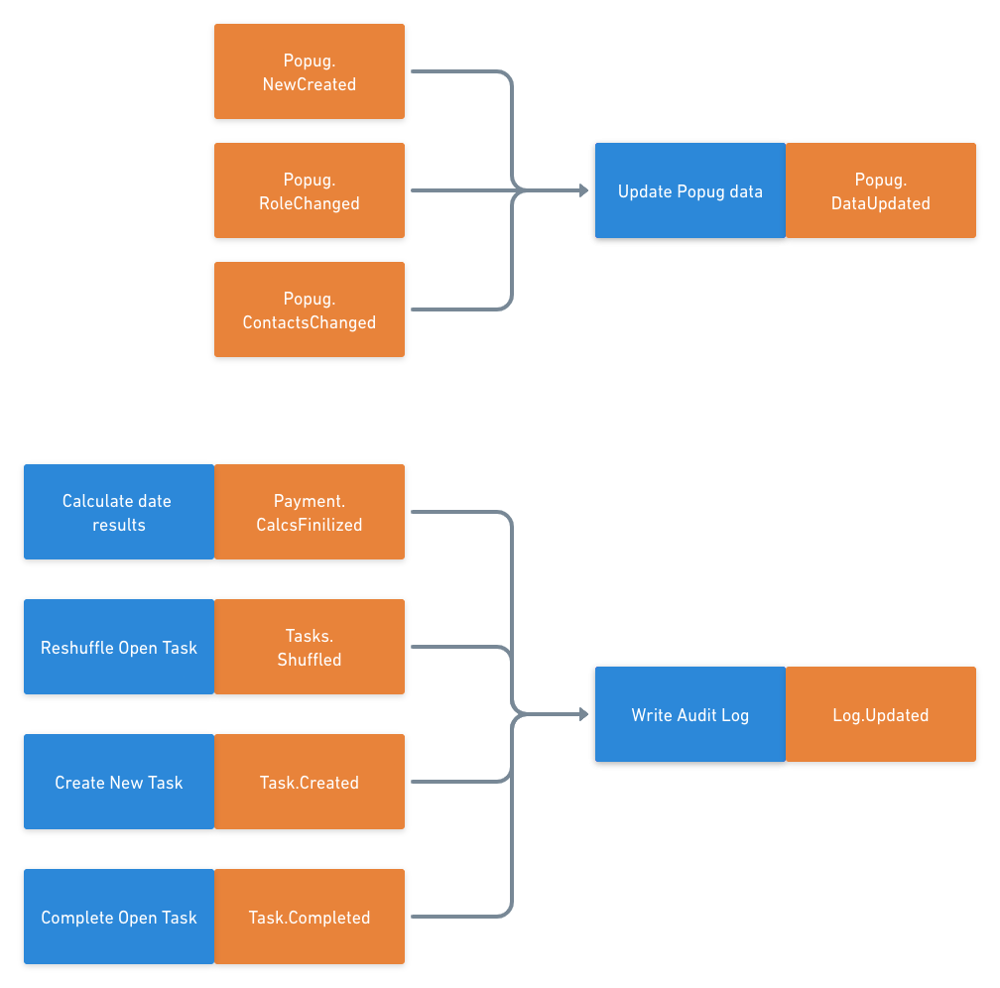
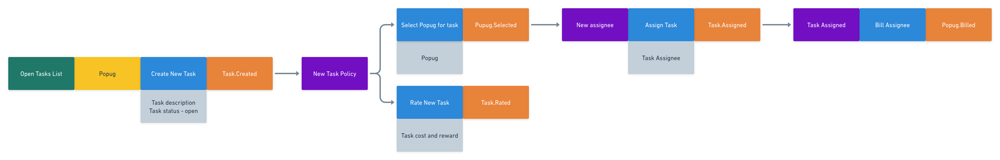
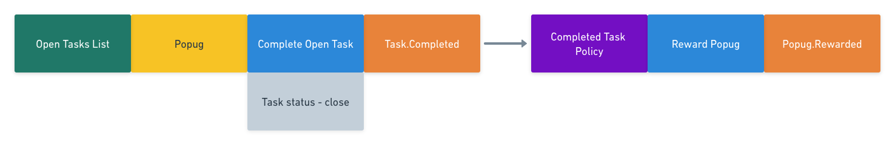
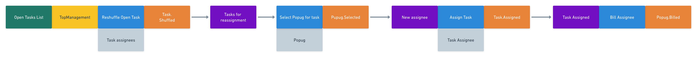
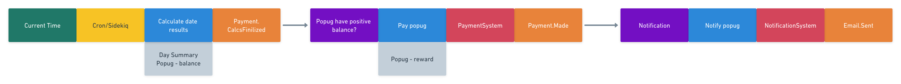
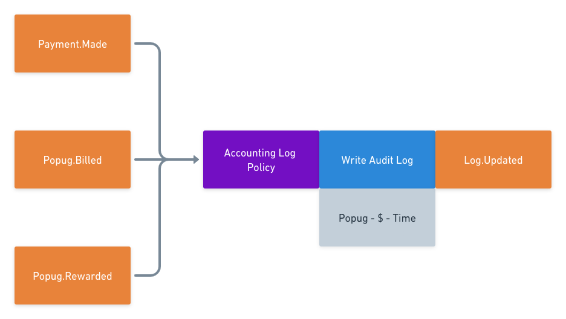
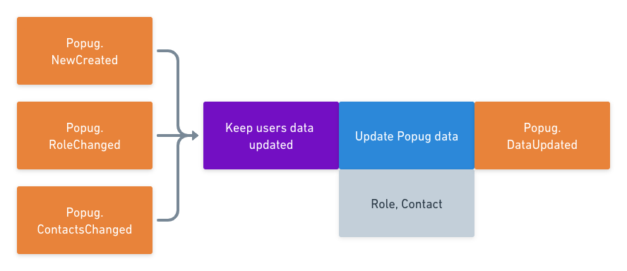
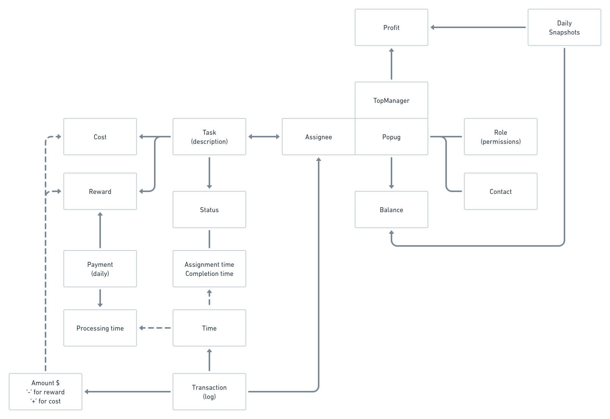
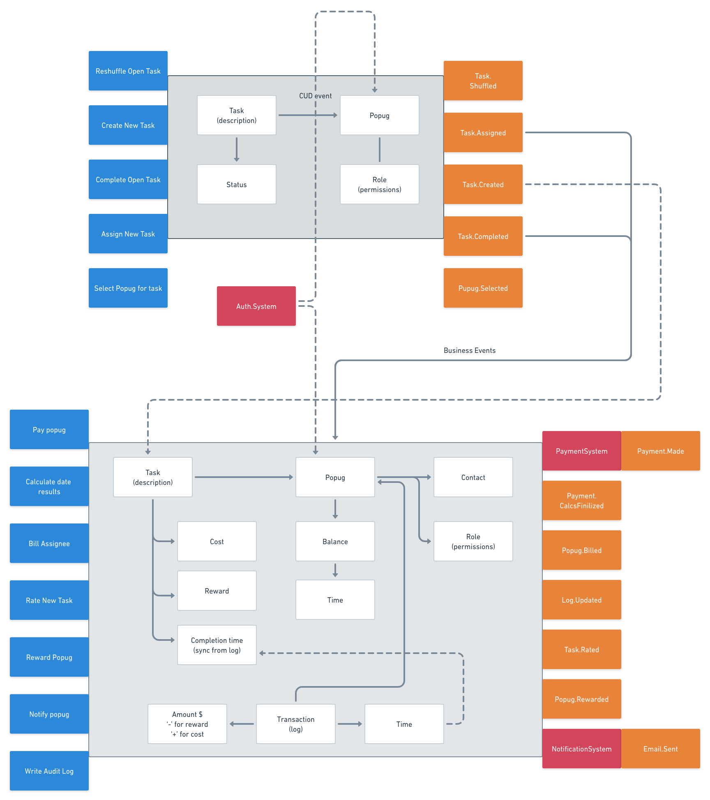

# Event Model

I followed steps descriged in [this article](https://mrpicky.dev/design-level-event-storming-with-examples/).

It is important to note that events at those diagrams are not necessary message broker events (business or CUD events).
Later will be selected after services are described.

## Big Picture Level

## Process Level

There are four main business processes that share logging. Log has to be shared for consistency. 
Individually they are shown below. [Altogether chart](media/rev1_ples_all_core.png).

Note: Log time envisioned is to be the time when log has received a message.

### New Task

### Complete Task

### Shuffle Tasks

### Make Payment

### Common Log

### External: Update Popug Data

# Data Model

# Design Level or Domains/Services

There are two services selected:

1. Taks Service
2. Accounting Service

External services:

- Auth Service
- PaymentSystem (sync communication ?)
- NotificationSystem (sync communication)

# Business Events

So at the end of the day, we see that only following events are passed between services:

| Event | Producer | Consumer |
| ----- | --------- | ----------- |
| Task Assigned | Task | Accounting |
| Task Completed | Task | Accounting |

All other events are internal to our services. I do not see any reason to inject messages between internal stages at
this point.

# CUD Events

Popug data and Task data is shared between services, therefore CUD events are to update those:

| Task | Data | Producer | Consumers |
| --- | --- | --- | --- |
| Popug Data Updated | New/Update/Delete, Name, Contacts, Roles | Auth | Task, Accounting |
| Taks Created | Task id | Task | Accounting | 

# Reflections

Some changes were done after watching the review session:

- Task assignment was joined b/w New Task and Shuffle Tasks processes
- Task created was a business event
